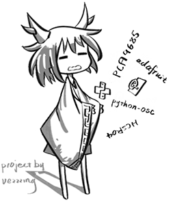
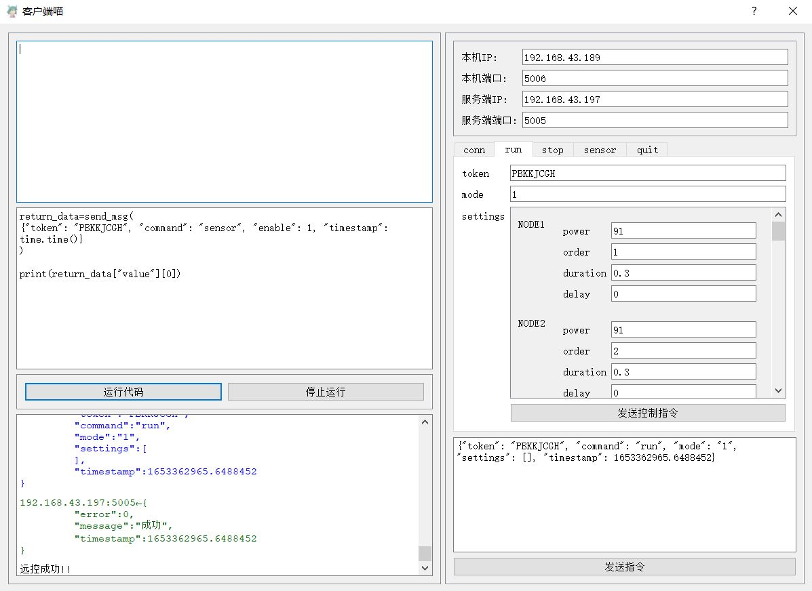

# 装置 OSC 通讯-文档

osc com installation
by vezzzing

---




智能硬件最后两周的作业
OSC 实现

用到的技术

Python python-osc PyQt5 adafruit_servokit

---

# 文件传输 DOC

客户端每次向服务端提交的请求中都会有一个**command**参数，该参数指定了请求的动作。

而服务端收到请求后，返回的参数中都会有一个**error**和**message**参数【即使成功也有】

关于这两个参数

| command 参数名称 | 说明                       |
| ---------------- | -------------------------- |
| conn             | 请求连接到服务端           |
| quit             | 请求服务端断开连接         |
| run              | 执行节点指令               |
| stop             | 停止所有节点指令，电位归零 |
| sensor           | 请求传感器数据             |

| error 错误码 | 错误名称       | message 消息                               |
| ------------ | -------------- | ------------------------------------------ |
| 0            | success        | 成功                                       |
| 1            | commandErr     | 命令【command 选项】不合法或者为空         |
| 2            | timestampErr   | 时间戳【timestamp 选项】不合法或者为空     |
| 3            | missInfo       | 缺少必要信息                               |
| 4            | jsonDecodeErr  | json 解析错误                              |
| 5            | serverNameErr  | 服务器名称【server】不对                   |
| 6            | tokenErr       | token 错误                                 |
| 7            | modeErr        | 模式【mode】不合法，run 命令中的 mode 选项 |
| 8            | noSetting      | 没有设置项，（run 命令中的）               |
| 9            | settingInvalid | 设置项不合法，（run 命令中的）             |
| 10           | sensorIdErr    | 传感器 ID 数据不合法                       |
| 999          | unknownErr     | 未知错误                                   |

关于 map，所有的命令都采用`/jsonmsg`头

### 连接到服务端

##### 客户端请求消息

```json
{
    "command": "conn",
    "id": 客户端ID,
    "server": 服务端ID,
    "timestamp": 时间戳
}
```

##### 服务端返回消息

1.连接成功

```json
{
    "error": 0,
    "message": "成功",
    "clientid": 客户端ID,
    "timestamp": 客户端上传的时间戳,
    "token": 一个随机八位字符串，用于标明客户端身份,
}
```

2.错误

```json
{
    "error":相应错误码,
    "message":相应错误消息,
}
```

---

### 执行节点指令

##### 客户端请求消息

###### 1.默认内置状态

```json
{
    "token": 服务端返回的token，客户端保存在本地，每次发起请求时带上，服务端校验身份,
    "command": "run",
    "mode": 1或2，运行状态,
    "settings": [], //空列表,
    "timestamp": 时间戳
}
```

###### 2.自定义状态

```json
{
    "token": 服务端返回的token，客户端保存在本地，每次发起请求时带上，服务端校验身份,
    "command": "run",
    "mode": 1或2，运行状态,
    "settings": [
        {
            "node":要运行的节点编号【1-16】,
            "power":对于舵机是旋转角度，对于其他是输出的电平【0-180】,
            "order":运行的顺序,
            "duration":运行持续时间,
            "delay":运行完成后等待时间
        },
        ...
    ],
    "timestamp": 时间戳
}
```

##### 服务端返回消息

1.成功

```json
{
    "error": 0,
    "message": "成功",
    "timestamp": 客户端上传的时间戳
}
```

2.错误

```json
{
    "error":相应错误码,
    "message":相应错误消息,
}
```

---

### 获取传感器数据

##### 客户端请求消息

###### 1.启用并读取值

```json
{
    "token": token,
    "command": "sensor",
    "enable": 要开启的服务器ID【从1开始的整数】,
    "timestamp": 时间戳
}
```

###### 2.关闭传感器

```json
{
    "token": token,
    "command": "sensor",
    "disable": 要开启的服务器ID【从1开始的整数】,
    "timestamp": 时间戳
}
```

##### 服务端返回消息

1.连接成功

###### 1.启用并读取值

```json
{
    "error": 0,
    "message": "成功",
    "sensor": 客户端请求读取的传感器ID,
    "value": [121,231...],//一个数组，内部包含读取到的值
    "timestamp": 客户端上传的时间戳
}
```

###### 2.关闭传感器

```json
{
    "error": 0,
    "message": "成功",
    "sensor": 客户端请求关闭的传感器ID,
    "timestamp": 客户端上传的时间戳
}
```

2.错误

```json
{
    "error":相应错误码,
    "message":相应错误消息,
}
```

---

### 从服务端断开连接

##### 客户端请求消息

```json
{
    "token": token,
    "command": "quit",
    "timestamp": 时间戳
}
```

##### 服务端返回消息

1.成功

```json
{
    "error": 0,
    "message": "成功",
    "timestamp": 客户端上传的时间戳
}
```

2.错误

```json
{
    "error":相应错误码,
    "message":相应错误消息,
}
```

---

# 服务端文件架构

-   client. py _最基础的客户端，用于返回数据_
    -   `VezClient`:客户端类
        -   `start(to_ip,to_port)`:绑定指定 ip 和 port
-   server. py _最基础的服务端，用于接收数据_
    -   `VezServer`:服务器类
        -   `start(from_ip,from_port)`:绑定指定 ip 和 port
-   warpedClient. py _客户端拓展_

    -   `WarpedClient`:包装过的客户端类【为了文件系统整洁做的，没有封装新的方法】

-   warpedServer. py _服务端拓展_ **主文件**

    -   `WarpedServer`:包装过的服务端类，内置一个 client 可以向客户端发送数据包
        -   `initClient(to_ip,to_port)`:给内置 client 绑定 ip 和 port
        -   `check_commandValid(data)`:检查 command 配置项是否合法【通过和 settings 中的字典进行比对】
        -   `do_command(data)`:根据 commmand 配置项“分流”执行相应命令，并调用 gpioActions. py 文件实现与硬件的连接
            -   `conn`:->生成 token 并返回，记录客户端连接信息并保存在服务端
            -   `run`:
                -   预定义指令
                ```python
                gpioActions.py->setMode1()
                gpioActions.py->setMode2()
                ...
                ```
                -   自定义指令
                ```python
                gpioActions.py->customAction(settings_obj)
                # 遍历settings_obj并执行相应动作
                ```
            -   `stop`:
                -   停止所有动作
                ```python
                gpioActions.py->stop()
                ```
            -   `sensor`:
                -   读取值
                ```python
                gpioActions.py->sensorEnable(id)
                # 返回值就是读取到的传感器值
                ```
                -   停止传感器
                ```python
                gpioActions.py->sensorDisable(id)
                ```
            -   `quit`:->从服务器退出登录，服务端销毁 token，和客户端所有信息
        -   `gen_token()`:生成 token 字符串
        -   `send_error(errorType)`:通过索引 settings 中的错误列表配置项来发送错误信息
        -   `send_message(sendData)`:传入一个字典，用于向指定的 ip 和 port 发送数据包
        -   `global_handler()`:接收到指令的全局处理函数

-   ipport. py _配置 ip，port，以及服务端和客户端的 id_
-   settings. py _其他配置项，一般不用动_

    -   `COMMAND_LIST`:所有命令
    -   `ERROR_LIST`:所有错误
    -   `MODE_LIST`:硬件所有预定义模式
    -   `LIGHT_PIN`:灯的 40PIN 信息

-   gpioActions. py
    -   `VG`:GPIO 操作类
        -   `setMode1()`:顾名思义
        -   `setMode2()`:顾名思义
        -   `customAction(settings_obj)`:自定义控制指令
        -   `stop()`:顾名思义
        -   `sensorEnable(id)`:启动传感器
        -   `sensorDisable(id)`:停止传感器

---

# 客户端文件架构

-   client. py _最基础的客户端，用于返回数据_
    -   `VezClient`:客户端类
        -   `start(to_ip,to_port)`:绑定指定 ip 和 port
-   server. py _最基础的服务端，用于接收数据_

    -   `VezServer`:服务器类
        -   `start(from_ip,from_port)`:绑定指定 ip 和 port
        -   `activate()`:激活服务器，开启一个计时器，超过一定时间没有收到客户端的数据包，则自动关闭服务器，防止线程阻塞
        -   `close()`:关闭服务器
        -   `handle_request()`:处理客户端请求
        -   `global_handler()`:接收到指令的全局处理函数
        -   `listen_count()`:时间到了强制关闭服务器

-   handshake. py _握手过程，客户端发送数据，服务端返回数据_

    -   `HandShake`:握手对象
        -   `send_message(data)`:发送数据，并且设置一个暂时的服务端来接收服务器返回的消息

-   format. py _将字典和列表美化，返回一个格式化的字符串用于输出_

-   gui. py _生成 gui 界面，绑定事件_

-   qssLoader. py _加载 qss 文件，指定样式_

-   ipport. py _配置默认的 ip，port，以及服务端和客户端的 id_
-   settings. py _其他配置项，一般不用动_
-   /qss 文件夹 _存放 qss 样式表_
-   /src 文件夹 _存放其他资源文件_

---

# 测试GUI



---

# 硬件

PCA9685 控制 10 个舵机，GPIO 引脚控制灯光

编号

| 类型   | 编号 | 编号 | 编号 |
| ------ | ---- | ---- | ---- |
| 灯光   | L3   | L2   | L1   |
| 舵机   | D9   | D6   | D3   |
| 舵机   | D8   | D5   | D2   |
| 舵机   | D7   | D4   | D1   |
| 灯光   | L6   | L5   | L4   |
| 磕头机 | D10  |      |      |

引脚分布

灯光：`LIGHT_PIN = [24, 23, 18, 21, 16, 20]`

舵机：`PCA9685-0~9`

传感器：超声波传感器：`GPIO17,GPIO27`


